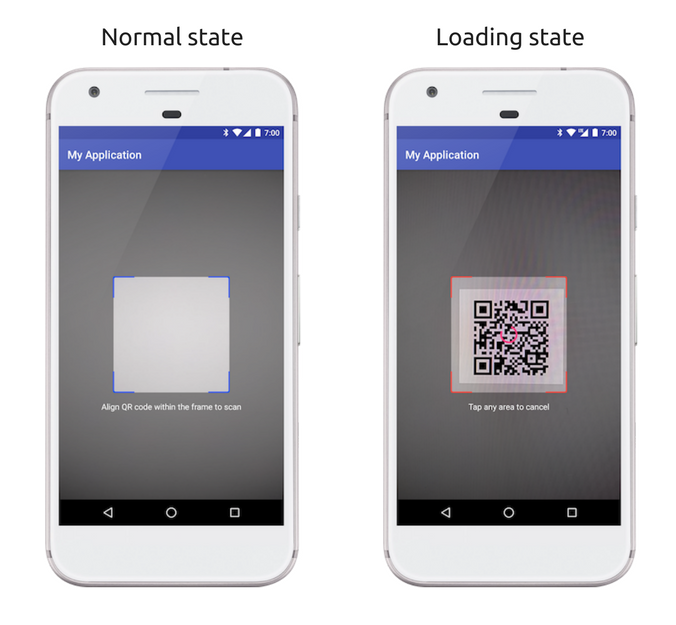

[](https://travis-ci.org/omisego/android-sdk)
[ ](https://bintray.com/omise-go/maven/omisego-sdk/_latestVersion)

# OmiseGO Android SDK

The [OmiseGO](https://omisego.network) Android SDK allows developers to easily interact with a node of the OmiseGO eWallet.

# Table of Contents

- [Requirements](#requirements)
- [Installation](#installation)
- [Usage](#usage)
  - [Initialization](#initialization)
  - [Retrieving resources](#retrieving-resources)
    - [Get the current user](#get-the-current-user)
    - [Get the wallets of the current user](#get-the-wallets-of-the-current-user)
    - [Get the provider settings](#get-the-provider-settings)
    - [Get the current user's transactions](#get-the-current-users-transactions)
  - [Transferring tokens](#transferring-tokens)
    - [Send tokens to an address](#send-tokens-to-an-address)
    - [Generate a transaction request](#generate-a-transaction-request)
    - [Consume a transaction request](#consume-a-transaction-request)
    - [Approve or Reject a transaction consumption](#approve-or-reject-a-transaction-consumption)
  - [QR codes](#qr-codes)
    - [Generate a QR code](#generate-qr-code-bitmap-representation-of-a-transaction-request)
    - [Scan a QR code](#scan-a-qr-code)
  - [Websocket](#websocket)
    - [Initialization](#websocket-initialization)
    - [Listen for the system event](#listen-for-the-system-event)
        - [Connection Event](#connection-event)
        - [Channel Event](#channel-event)
    - [Listen for the custom event](#listen-for-the-custom-event)
        - [TransactionRequest Event](#transactionrequest-event)
        - [TransactionConsumption Event](#transactionconsumption-event)  
    - [Stop listen for the custom event](#stop-listening-for-the-custom-event)
    - [Stop listen for the system event](#stop-listening-for-the-system-event)
- [Run Kotlin Lint](#run-kotlin-lint)
- [Test](#test)
- [Contributing](#contributing)
- [License](#license)
- [Sample Project](#sample-project)

## Requirements

- Minimum Android SDK version 19

## Installation

To use the OmiseGO SDK in your android project, simply add the following line in the module's `build.gradle`
 
```groovy
dependencies {
    implementation 'co.omisego:omisego-sdk:0.9.3'
}
```

## Usage

### Initialization

Before using the SDK to retrieve a resource, you need to initialize the client (`EWalletClient`) with a `ClientConfiguration` object.

You should do this as soon as you obtain a valid authentication token corresponding to the current user from the Wallet API.

Then you need to pass it to the `EWalletClient.Builder` and call `build()` to get the `EWalletClient` instance.

Lastly, you will need to pass the instance that you got from the previous step to the `OMGAPIClient`'s constructor.

For example,
```kotlin
 val config = ClientConfiguration(
     baseURL = "YOUR_BASE_URL",
     apiKey = "YOUR_API_KEY",
     authenticationToken = "YOUR_AUTH_TOKEN"
 )

 val eWalletClient = EWalletClient.Builder {
     clientConfiguration = config
     debug = false
 }.build()
 
 val omgAPIClient = OMGAPIClient(eWalletClient)
```

Where:
* `apiKey` is the api key generated from your OmiseGO admin panel.
* `authenticationToken` is the token corresponding to an OmiseGO Wallet user retrievable using one of our server-side SDKs.
> You can find more info on how to retrieve this token in the [OmiseGO server SDK documentations](https://github.com/omisego/ruby-sdk#login).
* `baseURL` is the URL of the OmiseGO Wallet API. **Note**: This need to be ended with '/'.
* `debug` *(Optional)* is a boolean indicating if the SDK should print logs in the console. default: `false`. 

## Retrieving resources

Once you have a client object in the [initialization section](#initialization), you can retrieve different resources.
Every call takes an `OMGCallback` interface that returns a `OMGResponse` object:

```kotlin
interface OMGCallback<in T> {
    fun success(response: OMGResponse<T>)
    fun fail(response: OMGResponse<APIError>)
}
```

```kotlin
data class OMGResponse<out T>(val version: String, val success: Boolean, val data: T)

data class APIError(val code: ErrorCode, val description: String)
```

Where:

`success` is the function invoked when the `success` boolean in the response is `true`. This function will provide the corresponding data model to an API endpoint.

`fail` is the function invoked when the `success` boolean in the response is `false`. This function will provide the `APIError` object which contains information about the failure.

### Get the current user

```kotlin
omgAPIClient.getCurrentUser().enqueue(object: OMGCallback<User>{
    override fun fail(response: OMGResponse<APIError>) {
        
    }

    override fun success(response: OMGResponse<User>) {
        
    }
})
```

### Get the wallets of the current user

```kotlin
omgAPIClient.listWallets().enqueue(object: OMGCallback<WalletList>{
    override fun fail(response: OMGResponse<APIError>) {
        
    }

    override fun success(response: OMGResponse<WalletList>) {
        
    }
})
```

> Note: For now a user will have only one wallet.

### Get the provider settings

```kotlin
omgAPIClient.getSettings().enqueue(object: OMGCallback<Setting>{
    override fun fail(response: OMGResponse<APIError>) {
        
    }

    override fun success(response: OMGResponse<Setting>) {
        
    }
})
```

### Get the current user's transactions
This returns a paginated filtered list of transactions.

In order to get this list you will need to create a `ListTransactionParams` object:

```kotlin
val request = ListTransactionParams.create(
    page = 1,
    perPage = 10,
    sortBy = Paginable.Transaction.SortableFields.CREATE_AT,
    sortDirection = SortDirection.ASCENDING,
    searchTerm = "confirmed", // or searchTerms = mapOf(STATUS to "completed")
    address = null
)
```

Where

* `page` is the page you wist to receive
* `perPage` is the number of results per page
* `sortBy` is the sorting field. The available values are:

    `ID`, `STATUS`, `FROM`, `TO`, `CREATED_AT`
    
    > `import co.omisego.omisego.model.pagination.Paginable.Transaction.SortableFields.*`
    
* `sortDirection` is the sorting direction. The available values are:
    
    `ASCENDING`, `DESCENDING`
    
    > `import co.omisego.omisego.model.pagination.SortDirection.*`
    
* `searchTerm` *(optional)* is a term to search for all of the searchable fields. 
      Conflict with `searchTerms`, only use one of them. The available values are:
    
    `ID`, `STATUS`, `FROM`, `TO`,
      
    > `import co.omisego.omisego.model.pagination.Paginable.Transaction.SearchableFields.*`
    
* `searchTerms` *(optional)* is a key-value map of fields to search with the available fields (same as `searchTerm`)
    For example:
    
    ```kotlin
    mapOf(FROM to "some_address", ID to "some_id")
    ```

* `address` *(optional)* is an optional address that belongs to the current user (primary wallet address by default)

Then you can call:

```kotlin
omgAPIClient.listTransactions(request).enqueue(object: OMGCallback<PaginationList<Transaction>>{
    override fun fail(response: OMGResponse<APIError>) {
        //TODO: Handle the error
    }

    override fun success(response: OMGResponse<PaginationList<Transaction>>) {
        //TODO: Do something with the paginated list of transactions
    }
})
```
   
There is `PaginationList<Transaction>` inside the `response.data` which contains `data: List<Transaction>` and `pagination: Pagination`

Where:
* `data` is an array of transactions
* `pagination` is a `Pagination` object
    
    Where:
    * `perPage` is the number of results per page.
    * `currentPage` is the retrieved page.
    * `isFirstPage` is a bool indicating if the page received is the first page
    * `isLastPage` is a bool indicating if the page received is the last page

## Transferring tokens

The SDK offers 2 ways for transferring tokens between addresses:
- A simple one way transfer from one of the current user's wallets to an address.
- A highly configurable send/receive mechanism in 2 steps using transaction requests.

#### Send tokens to an address

The most basic way to transfer tokens is to use the `omgAPIClient.transfer()` method, which allows the current user to send tokens from one of its wallet to a specific address.

```kotlin
val request = TransactionSendParams(
    from = "1e3982f5-4a27-498d-a91b-7bb2e2a8d3d1",
    to = "2e3982f5-4a27-498d-a91b-7bb2e2a8d3d1",
    amount = 1000.bd,
    tokenId =  "BTC:xe3982f5-4a27-498d-a91b-7bb2e2a8d3d1"
)

omgAPIClient.transfer(request).enqueue(object : OMGCallback<Transaction>{
    override fun success(response: OMGResponse<Transaction>) {
        // Do something
    }

    override fun fail(response: OMGResponse<APIError>) {
        // Handle error
    }
})
```

### Generate a transaction request

A more configurable way to transfer tokens between 2 addresses is to use the transaction request flow.
To make a transaction happen, a `TransactionRequest` needs to be created and consumed by a `TransactionConsumption`.

To generate a new transaction request you can call:

```kotlin
/* Short version */
val request = TransactionRequestCreateParams(
    type = TransactionRequestType.RECEIVE,
    tokenId = "a_token_id"
)

/* Full version */
val request = TransactionRequestCreateParams(
    type = TransactionRequestType.RECEIVE,
    tokenId = "a_token_id",
    amount = 10_240, /* If the token has subUnitToUnit = 1,000, it means this request want to receive 10.24 OMG */
    address = "receiver_address",
    correlationId = "correlation_id",
    requireConfirmation = false,
    maxConsumption = 10,
    consumptionLifetime = 60000,
    expirationDate = null,
    allowAmountOverride = true,
    maxConsumptionsPerUser = null,
    metadata = mapof<String, Any>(),
    encryptedMetadata = mapOf<String, Any>()
)

val omgAPIClient = YOUR_OMG_API_CLIENT

omgAPIClient.createTransactionRequest(request).enqueue(object : OMGCallback<TransactionRequest> {
    override fun success(response: OMGResponse<TransactionRequest>) {
        //TODO: Do something with the transaction request (get the QR code representation for example)
    }

    override fun fail(response: OMGResponse<APIError>) {
        //TODO: Handle the error
    }
})
```

Where:
* `request` is a `TransactionRequestParams` data class constructed using:
    * `type`: The QR code type, only supports `TransactionRequestType.RECEIVE` for now.
    * `tokenId`: The id of the desired token.
    * `amount`: (optional) The amount of token to receive. This amount can be either inputted when generating or consuming a transaction request.
    * `address`: (optional) The address specifying where the transaction should be sent to. If not specified, the current user's primary wallet address will be used.
    * `correlationId`: (optional) An id that can uniquely identify a transaction. Typically an order id from a provider.
    * `requireConfirmation`: A boolean indicating if the request needs a confirmation from the requester before being proceeded.
    * `maxConsumptions`: (optional) The maximum number of time that this request can be consumed. Default `null` (unlimited).
    * `consumptionLifetime`: (optional) The amount of time in millisecond during which a consumption is valid. Default `null` (forever).
    * `expirationDate`: (optional) The date when the request will expire and not be consumable anymore. Default `null` (never expired).
    * `allowAmountOverride`: (optional) Allow or not the consumer to override the amount specified in the request. This needs to be true if the amount is not specified
    > Note that if amount is nil and allowAmountOverride is false the init will fail and return null.
    * `maxConsumptionsPerUser`: (optional) The maximum number of consumptions allowed per unique user. Default `null` (unlimited).
    * `metadata`: Additional metadata embedded with the request
    * `encryptedMetadata`: Additional encrypted metadata embedded with the request

A `TransactionRequest` object is passed to the success callback, you can generate its QR code representation using `transactionRequest.generateQRCode(size)`.

### Consume a transaction request
The previously created `transactionRequest` can then be consumed:

```kotlin
/* Short version */
val request = TransactionConsumptionParams.create(
    transactionRequest
)

/* Full version */
val request = TransactionConsumptionParams.create(
    transactionRequest,
    amount = 25_000.bd, // BigDecimal
    address = "an address",
    tokenId = "A token id",
    idempotencyToken = "An idempotency token",
    correlationId = "a correlation id",
    metadata = mapOf(),
    encryptedMetadata = mapOf()
)

omgAPIClient.consumeTransactionRequest(request).enqueue(object : OMGCallback<TransactionConsumption> {
    override fun success(response: OMGResponse<TransactionConsumption>) {
        // Handle success
    }

    override fun fail(response: OMGResponse<APIError>) {
        // Handle error
    }
})
```

Where 
* `request` is a `TransactionConsumptionParams` data class constructed using:
    * `transactionRequest`: The transactionRequest obtained from the QR scanner.
    * `address`: (optional) The address from which to take the funds. If not specified, the current user's primary wallet address will be used.
    * `tokenId`: (optional) The token id to use for the consumption.
    * `amount`: (optional) The amount of token to send. This amount can be either inputted when generating or consuming a transaction request.
    
        > Note that if the amount was not specified in the transaction request it needs to be specified here, otherwise the init will fail and throw `IllegalArgumentException`.
        
    * `idempotencyToken`: The idempotency token used to ensure that the transaction will be executed one time only on the server. If the network call fails, you should reuse the same idempotencyToken when retrying the request.
    * `correlationId`: (optional) An id that can uniquely identify a transaction. Typically an order id from a provider.
    * `metadata`: A dictionary of additional data to be stored for this transaction consumption.
    * `encryptedMetadata`: A dictionary of additional encrypted data to be stored for this transaction consumption.

### Approve or Reject a transaction consumption
The `TransactionConsumption` object can be used to `approve` or `reject` the transaction consumption. 
Once you receive the `transactionConsumption` object, you can call `approve` or `reject` function. 
The function will then return the `OMGCall<TransactionConsumption>` object to be used for making the actual request to the API.
 
```kotlin
val approveRequest = transactionConsumption.approve(omgAPIClient)
val rejectRequest = transactionConsumption.reject(omgAPIClient)

// Approve a transaction consumption
approveRequest.enqueue(object: OMGCallback<TransactionConsumption>{
    override fun success(response: OMGResponse<TransactionConsumption>) {
        // Handle success
    }

    override fun fail(response: OMGResponse<APIError>) {
        // Handle error
    }
})

// Reject a transaction consumption
rejectRequest.enqueue(object: OMGCallback<TransactionConsumption>{
    override fun success(response: OMGResponse<TransactionConsumption>) {
        // Handle success
    }

    override fun fail(response: OMGResponse<APIError>) {
        // Handle error
    }
})
```

## QR Codes
This SDK offers the possibility to generate and consume transaction requests. Typically these actions should be done through the generation and scan of QR codes.

### Generate QR Code Bitmap representation of a transaction request
Once a `TransactionRequest` is created, you can get its QR code representation using `generateQRCode(size)`.
This method takes an optional `size` param that can be used to define the expected size of the generated QR bitmap.

```kotlin
val bitmap = txRequest.generateQRCode(512) // Create a 512x512 QR code 
```

### Scan a QR code
You can then use the `OMGQRScannerView` to scan the generated QR code.

<p align="center">
  
</p>

**First**, you need to add `OMGQRScannerView` to your xml.

> Note: You can customize the border color of the QR code frame of the scanner like the following 

**activity_qr_scanner.xml**
```xml
<?xml version="1.0" encoding="utf-8"?>
<FrameLayout xmlns:android="http://schemas.android.com/apk/res/android"
             xmlns:app="http://schemas.android.com/apk/res-auto"
             android:layout_width="match_parent"
             android:layout_height="match_parent">

    <co.omisego.omisego.qrcode.scanner.OMGQRScannerView
        android:id="@+id/scannerView"
        android:layout_width="match_parent"
        android:layout_height="match_parent"
        app:borderColor="@color/qrBorderColor"
        app:borderColorLoading="@color/qrBorderColorLoading" />
        
</FrameLayout>
```

**Then**, you can call `scannerView.startCamera` passing your `OMGAPIClient` and `OMGQRScannerContract.Callback` respectively to start the camera.

> Note: You need to handle the camera permission first

```kotlin
class QRScannerActivity : AppCompatActivity(), OMGQRScannerContract.Callback {
    private lateinit var omgAPIClient: OMGAPIClient

    override fun onCreate(savedInstanceState: Bundle?) {
        super.onCreate(savedInstanceState)
        setContentView(R.layout.activity_qrscanner)
        
        omgAPIClient = your_omg_api_client
        scannerView.startCamera(omgAPIClient, this)
    }

    override fun scannerDidCancel(view: OMGQRScannerContract.View) {

    }

    override fun scannerDidDecode(view: OMGQRScannerContract.View, payload: OMGResponse<TransactionRequest>) {

    }

    override fun scannerDidFailToDecode(view: OMGQRScannerContract.View, exception: OMGResponse<APIError>) {
    
    }

    override fun onPause() {
        super.onPause()
        scannerView.stopCamera()
    } 

    override fun onResume() {
        super.onResume()
        scannerView.startCamera(omgAPIClient, this)
    }
}
```

As you can see, the `OMGQRScannerContract.Callback` offers the following interface:

```kotlin
/**
 * Called when the user tap on the screen. The request to the backend will be cancelled.
 *
 * @param view The QR scanner view
 */
fun scannerDidCancel(view: OMGQRScannerContract.View)

/**
 * Called when a QR code was successfully decoded to a TransactionRequest object
 *
 * @param view The QR scanner view
 * @param transactionRequest The transaction request decoded by the scanner
 */
fun scannerDidDecode(view: OMGQRScannerContract.View, transactionRequest: OMGResponse<TransactionRequest>)

/**
 * Called when a QR code has been scanned but the scanner was not able to decode it as a TransactionRequest
 *
 * @param view The QR scanner view
 * @param exception The error returned by the scanner
 */
fun scannerDidFailToDecode(view: OMGQRScannerContract.View, exception: OMGResponse<APIError>)
```

When the scanner successfully decodes a `TransactionRequest` it will call its delegate method `scannerDidDecode(view: OMGQRScannerContract.View, transactionRequest: TransactionRequest)`.


**Finally**, add the following lines to your `AndroidManifest.xml`

```xml
<manifest xmlns:android="http://schemas.android.com/apk/res/android"
    package="com.your.package">
    
    <!-- Add this 3 lines -->
    <uses-feature android:name="android.hardware.camera" />
    <uses-feature android:name="android.hardware.camera.autofocus" />
    <uses-permission android:name="android.permission.CAMERA" />
    
    <application>
        <!-- Your activities -->
    </application>
</manifest>
```

# Websocket

The transaction request flow is as follow:

1. Create a `TransactionRequest` successfully.
2. Consume that `TransactionRequest` which will generate a TransactionConsumption.
3. Approve or reject the `TransactionConsumption` generated in step 2.

This section describes the use of the `OMGSocketClient` in order to listen for events which happens after step 2 or step 3.

## Websocket Initialization

Similarly to the `OMGAPIClient`, the `OMGSocketClient` needs to be first initialized with a `ClientConfiguration` before using it.

```kotlin
val config = ClientConfiguration(
     baseURL = "YOUR_BASE_URL",
     apiKey = "YOUR_API_KEY",
     authenticationToken = "YOUR_AUTH_TOKEN"
 )
 
val socketClient = OMGSocketClient.Builder {
    clientConfiguration = config
    debug = false
}.build()
```

Where:
* `apiKey` is the API key (typically generated on the admin panel).
* `authenticationToken` is the token corresponding to an OmiseGO Wallet user retrievable using one of our server-side SDKs.
> You can find more info on how to retrieve this token in the [OmiseGO server SDK documentations](https://github.com/omisego/ruby-sdk#login). 
* `baseURL` is the URL of the OmiseGO Wallet API, this needs to be an ws(s) url. **Note**: This need to be ended with '/'.
* `debug` *(Optional)* is a boolean indicating if the SDK should print logs in the console. default: `false`.

## Listen for system events

The system event is giving general information related to the status of the web socket connection.
All listenable system events are the **Connection status** and the **Channel status**. 

### Connection Event

`SocketConnectionListener` *(optional)* is the listener that listens for a **web socket's server connection status**. The possible events are:

* `onConnected()`: Invoked when the web socket client has connected to the eWallet web socket API successfully.
* `onDisconnected(throwable: Throwable)`: Invoked when the web socket client has disconnected from the eWallet web socket API.
Throws an exception if the web socket was not disconnected successfully.

**Usage**
```kotlin
socketClient.setConnectionListener(object : SocketConnectionListener {
    override fun onConnected() {
        // Do something
    }

    override fun onDisconnected(throwable: Throwable?) {
        // Do something
    }
})
```
### Channel Event

`SocketChannelListener` *(optional)* is the listener that listens for a **channel connection status**. The possible events are:

* `onJoinedChannel(topic: String)`: Invoked when the client have been joined the channel successfully.
* `onLeftChannel(topic: String)`: Invoked when the client have been left the channel successfully.
* `onError(apiError: APIError)`: Invoked when something goes wrong while connecting to a channel.
    
**Usage**
```kotlin
socketClient.setChannelListener(object : SocketChannelListener {
    override fun onJoinedChannel(topic: String) {
        // Do something
    }

    override fun onLeftChannel(topic: String) {
        // Do something
    }

    override fun onError(apiError: APIError) {
        // Handle an error
    }
})
```

## Listen for custom events

Custom event are special events that are currently limited to the `TransactionRequest` and the `TransactionConsumption` event.
All custom events will be a sub-class of the `SocketCustomEventListener`. `SocketCustomEventListener` is a **required** generic listener that you will need to pass its sub-class when joining to the channel for listening to the events.
All possible listeners are the following:

### TransactionRequest Event

When creating a `TransactionRequest` that requires a confirmation it is possible to listen for all incoming events using the `TransactionRequestListener`.
The possible events are: 
* `onTransactionConsumptionRequest(TransactionConsumption)`: Invoked when a `TransactionConsumption` is trying to consume the `TransactionRequest`. 
This allows the requester to [confirm](https://github.com/omisego/ios-sdk#confirm-a-transaction-consumption) or not the consumption if legitimate. 
* `onTransactionConsumptionFinalizedSuccess(TransactionConsumption)`: Invoked if a `TransactionConsumption` has been finalized successfully, and the transfer was made between the 2 addresses.
* `onTransactionConsumptionFinalizedFail(TransactionConsumption, APIError)`: Invoked if a `TransactionConsumption` fails to consume the request.
        
### TransactionConsumption Event
 
Similarly to the `TransactionRequestListener`, a `TransactionConsumption` can be listened for incoming confirmations using the `TransactionConsumptionListener`.
The possible events are:
* `onTransactionConsumptionFinalizedSuccess(TransactionConsumption)`: Invoked if a `TransactionConsumption` has been finalized successfully, and the transfer was made between the 2 addresses.
* `onTransactionConsumptionFinalizedFail(TransactionConsumption, APIError)`: Invoked if a `TransactionConsumption` fails to consume the request.

**Usage**
```kotlin
// The transaction requestor listen for the event 
transactionRequest.startListeningEvents(socketClient, object: SocketCustomEventListener.TransactionRequestListener() {
   override fun onTransactionConsumptionRequest(transactionConsumption: TransactionConsumption) {
       // Do something
   }

   override fun onTransactionConsumptionFinalizedSuccess(transactionConsumption: TransactionConsumption) {
       // Do something
   }

   override fun onTransactionConsumptionFinalizedFail(transactionConsumption: TransactionConsumption, apiError: APIError) {
       // Do something
   }
})

// The transaction consumer listen for the event
transactionConsumption.startListeningEvents(socketClient, object: SocketCustomEventListener.TransactionConsumptionListener() {
  override fun onTransactionConsumptionFinalizedSuccess(transactionConsumption: TransactionConsumption) {
      // Do something
  }

  override fun onTransactionConsumptionFinalizedFail(transactionConsumption: TransactionConsumption, apiError: APIError) {
      // Do something
  }
})
```

You might want to listen for the event later after you got the `TransactionRequest` or `TransactionConsumption` object, but you might not want to pass the object around.
In this case, it is possible to keep only the `SocketTopic` directly. 

Then you can alternatively listening for custom events by using `joinChannel` method of the `OMGSocketClient` instance.
This implementation will provide the exactly same result as the implementation above ☝️. For example,

```kotlin
// The transaction requestor listen for the event 
// Typically, it doesn't need to create a [SocketTopic] instance. it can be retrieved from the `TransactionRequest` or `TransactionConsumption` object.
val topic = SocketTopic<SocketCustomEventListener.TransactionRequestListener>("transaction_request:1234")
socketClient.joinChannel(topic, listener = object: SocketCustomEventListener.TransactionRequestListener(){
  override fun onTransactionConsumptionRequest(transactionConsumption: TransactionConsumption) {
      // Do something
  }

  override fun onTransactionConsumptionFinalizedSuccess(transactionConsumption: TransactionConsumption) {
      // Do something
  }

  override fun onTransactionConsumptionFinalizedFail(transactionConsumption: TransactionConsumption, apiError: APIError) {
      // Do something
  }
})

// The transaction consumer listen for the event
// Typically, it doesn't need to create a [SocketTopic] instance. it can be retrieved from the `TransactionRequest` or `TransactionConsumption` object.
val topic = SocketTopic<SocketCustomEventListener.TransactionConsumptionListener>("transaction_request:1234")
socketClient.joinChannel(topic, listener = object: SocketCustomEventListener.TransactionConsumptionListener() {
    override fun onTransactionConsumptionFinalizedSuccess(transactionConsumption: TransactionConsumption) {
        // Do something
    }

    override fun onTransactionConsumptionFinalizedFail(transactionConsumption: TransactionConsumption, apiError: APIError) {
        // Do something
    }
})
```

## Stop listening for the custom event

When you don't need to receive events anymore, you should call `stopListening(client: SocketClient)` for the corresponding `Listenable` object.
This will leave the corresponding socket channel and close the connection if no other channel is active.

For example,

```kotlin
transactionRequest.stopListening(socketClient)
// Or
transactionConsumption.stopListening(socketClient)
```

## Stop listening for the system event

The web socket client will be disconnected automatically if no other channel is active, so you won't receive any system event after that.

By the way, if you want to stop listening before that happen, you can pass `null` to both `omgSocketClient.setConnectionListener` and `omgSocketClient.setChannelListener`.

# Run Kotlin Lint

Simply run `./gradlew ktlintCheck` under project root directory.

# Test

You can simply run the test under the `src/test` folder from the Android Studio or run the command `./gradlew test`.

# Contributing

See [how you can help](.github/CONTRIBUTING.md).

# License

The OmiseGO Android SDK is released under the [Apache License](https://www.apache.org/licenses/LICENSE-2.0).

# Sample Project

You can check out the latest sample app from the following repo : [OMGShop](https://github.com/omisego/sample-android)